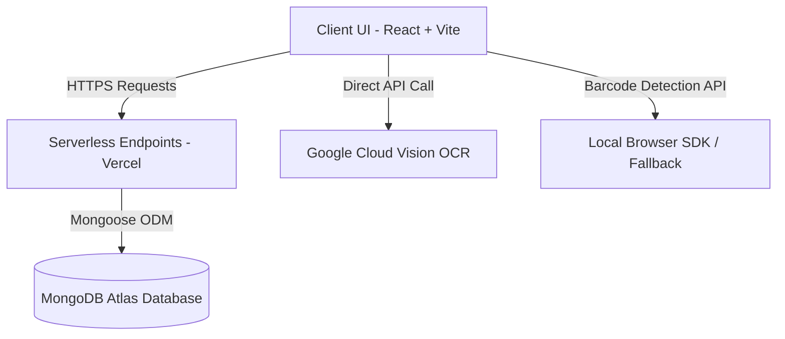

# Label Lens - Technical Developer Guide

**Author:** Srujan  
**Contact:** asgaladechronicles@gmail.com  
**Version:** 1.0.0

This document provides a comprehensive technical overview of **Label Lens** (Smart-Bite), designed for developers, maintainers, and hackathon technical evaluators.

---

## 🛠️ Tech Stack & Architecture

Label Lens is built on a modern full-stack architecture featuring a **Serverless Backend** and a **Fast Single Page Frontend (SPA)**.



### 1. Frontend: React & Vite
*   **Vite** was selected over standard Create React App (CRA) or Next.js frontend rendering due to:
    *   **Lightning-Fast Development:** Leverages native ES modules for instant hot module replacement (HMR).
    *   **Optimized Production Build:** Uses Rollup to generate highly tree-shaken and split static assets, decreasing load time to under 1 second.
    *   **Configurability:** Seamless integration with TypeScript and CSS-in-JS configurations.
*   **Styling:** Custom styling built on Vanilla CSS utilities to ensure full responsive control and zero external footprint.
*   **Icons:** Lucide React for consistent visual metaphors.

### 2. Backend: Serverless Functions (Vercel Node.js API)
*   Located in the `/api` directory.
*   Runs on Vercel's Edge/Serverless infrastructure, meaning zero maintenance, instant horizontal scaling, and zero hosting costs when inactive.
*   Uses **Express-like micro-routes** mapping directly to database handlers.

### 3. Database: MongoDB Atlas (Mongoose ODM)
*   **MongoDB** was chosen for its schema flexibility, allowing scans with variable numbers of declarations and violations to be saved dynamically without strict migrations.
*   **Schemas:**
    *   `UserSchema`: Storing email, password (hashed via `bcryptjs`), and optional Google OAuth identifier profiles.
    *   `ProductSchema`: Capturing name, barcode, mfg/expiry dates, FSSAI license, compliance score, status classification, detailed violations log, and scanning metadata.

---

## 🧠 Core Algorithmic Systems

### 1. OCR Parser & Capturing Engine
*   **Service File:** [`src/services/complianceService.ts`](file:///c:/Users/asgal/Downloads/Smart-Bite-main/Smart-Bite-main/src/services/complianceService.ts)
*   Runs OCR text blocks through a pattern-matching state machine to extract the 10 mandatory declarations under Legal Metrology Rules.
*   Uses regex capture groups rather than raw strings to discard prefixes (e.g. parsing `MRP: Rs. 250.00` down to `250.00`).

### 2. Legal Metrology Rule 13 Font Analyzer
*   Evaluates font height compliance dynamically matching India's **Legal Metrology (Packaged Commodities) Rules, 2011 (Rule 13)**.
*   **Algorithm Flow:**
    1. Parse the weight/volume value inside `netQuantity` and normalize it to grams (e.g. Converting metric/imperial sizes such as `16 oz` or `1 kg`).
    2. Determine the legal minimum letter height requirement:
        *   $\le$ 50g: **1.0 mm**
        *   50g – 200g: **1.5 mm**
        *   200g – 1kg: **2.0 mm**
        *   $>$ 1kg: **4.0 mm**
    3. Evaluate OCR confidence scores on all parsed tokens. If the confidence of any verified token is `low` (indicating printing size is too small, blurry, or low-contrast), the system generates a **Readability / Font Size Check** violation displaying the required minimum legal height in millimeters.

### 3. Dual-Layer Barcode Engine
*   **Service File:** [`src/services/visionService.ts`](file:///c:/Users/asgal/Downloads/Smart-Bite-main/Smart-Bite-main/src/services/visionService.ts)
*   **Primary Layer:** Native browser `BarcodeDetector` processing canvas frame buffers locally.
*   **Secondary Layer:** Server-side fallback that extracts barcode digits directly from raw text layouts using regex patterns if camera drivers fail.

---

## 🚀 Local Setup & Build Commands

1.  **Install dependencies:**
    ```bash
    npm install
    ```
2.  **Run development server:**
    ```bash
    npm run dev
    ```
3.  **Compile verification build:**
    ```bash
    npx tsc --noEmit
    ```
4.  **Production build compilation:**
    ```bash
    npm run build
    ```
